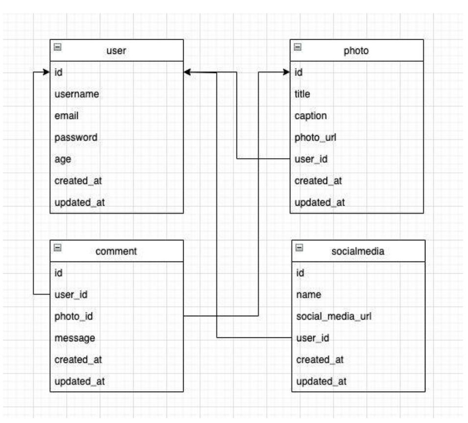

# MyGram
 it's the final project of the training program (Scalable Web Services with Golang) organized by Kominfo x Hacktiv8
 

 # Requirements

# Documentation
1. Swagger: hit {{hostname}}/swagger/index.html
2. Postman: import the file in Postman located at ./my-gram.postman_collection.json